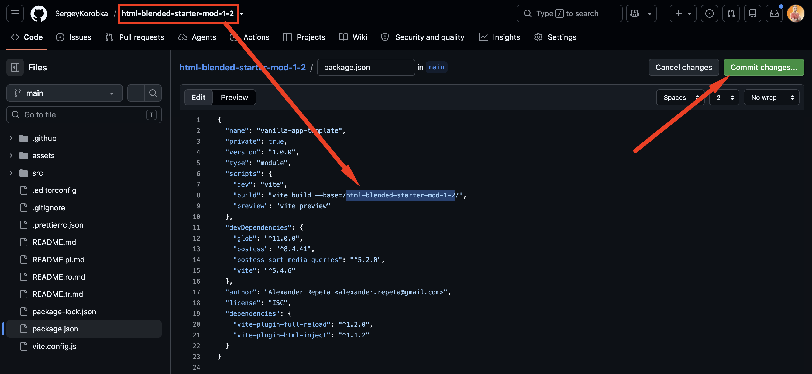
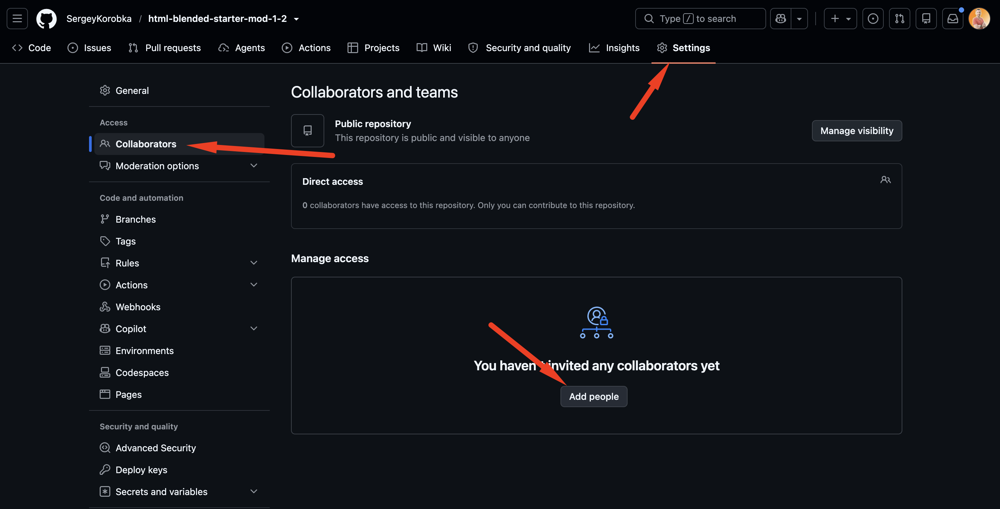

# Vanilla App Template

Цей проект було створено за допомогою Vite. Для знайомства та налаштування
додаткових можливостей [звернись до документації](https://vitejs.dev/).

## Створення репозиторію за шаблоном

Використовуй цей репозиторій організації GoIT як шаблон для створення
репозиторію свого проекту. Для цього натисни на кнопку `«Use this template»` і
обери опцію `«Create a new repository»`, як показано на зображенні.


На наступному етапі відкриється сторінка створення нового репозиторію. Заповни
поле його імені, переконайся, що репозиторій публічний, після чого натисни
кнопку `«Create repository from template»`.


Після того, як репозиторій буде створено, необхідно перейти в налаштування
створеного репозиторію на вкладку `Settings` > `Actions` > `General` як показано
на зображенні.


Проскроливши сторінку до самого кінця, в секції `«Workflow permissions»` обери
опцію `«Read and write permissions»` і постав галочку в чекбоксі. Це необхідно
для автоматизації процесу деплою проекту.


Тепер у тебе є особистий репозиторій проекту, зі структурою файлів та папок
репозиторію-шаблону. Далі працюй з ним, як з будь-яким іншим особистим
репозиторієм, клонуй його собі на комп'ютер, пиши код, роби коміти та відправляй
їх на GitHub.

## Деплой

Продакшн версія проекту буде автоматично збиратися та деплоїтись на GitHub
Pages, у гілку `gh-pages`, щоразу, коли оновлюється гілка `main`. Наприклад,
після прямого пуша або прийнятого пул-реквесту. Для цього необхідно у файлі
`package.json` змінити значення прапора `--base=/<REPO>/`, для команди `build`,
замінивши `<REPO>` на назву свого репозиторію, та відправити зміни на GitHub.

```json
"build": "vite build --base=/<REPO>/",
```

Відкриваємо на гітхабі файл package.json та натискаємо edit для внесення змін.


Додаємо в `--base=/<REPO>/` назву свого репозиторія.


Далі необхідно зайти в налаштування GitHub-репозиторію (`Settings` > `Pages`) та
виставити роздачу продакшн версії файлів з папки `/root` гілки `gh-pages`, якщо
це не було зроблено автоматично.


## Додавання учасників до проєкту

Після того як всі налаштування виконано, саме час додати учасників до проєкту,
що була змога працювати з ним як зі своїм. Необхідно перейти в налаштування
репозиторію на вкладку `Settings` > `Collaborators` натиснути кнопку
`add people` як показано на зображенні та в полі пошуку ввести email або
nickname користувача якого бажаєте додати.



## Підготовка до роботи

1. Переконайся, що на комп'ютері встановлено LTS-версію Node.js.
   [Скачай та встанови](https://nodejs.org/en/) її якщо необхідно.
2. Встанови базові залежності проекту в терміналі командою `npm install`.
3. Запусти режим розробки, виконавши в терміналі команду `npm run dev`.
4. Перейдіть у браузері за адресою
   [http://localhost:5173](http://localhost:5173). Ця сторінка буде автоматично
   перезавантажуватись після збереження змін у файли проекту.

## Файли і папки

Файли розмітки компонентів під кожну секцію сторінки знаходяться в папці
`src/partials`, кожен розробник працює тільки в своєму файлі.

Файли стилів знаходяться в папці `src/css` та імпортуються в головний файл
`main.css`, кожен розробник працює тільки в своєму файлі.

Зображення додані до папки `src/img` у відповідні підпапки з назвою секції.

Особливості підключення зображень: В розмітці в `src` до зображень в бандлері
повинен починатися з `/img` наприклад `/img/назва-зображення.jpg`
